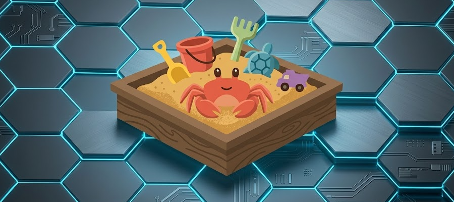

# sandcrab
## _It's `auto mode` galore, baby!_


Run [Claude Code](https://github.com/anthropics/claude-code) inside a disposable Docker sandbox. `sandcrab` mounts the current directory into an Ubuntu container and runs `claude` there, so the agent can only touch the project you launched it from. It

## Installation
```sh
curl -fsSL https://raw.githubusercontent.com/RowDaBoat/sandcrab/master/install.sh | sh
```

This installs `sandcrab` into `~/.sandcrab/bin`; add that directory to your `PATH`. You'll also need [Docker](https://docs.docker.com/get-docker/) installed and running.

## Usage

From any project directory, run:

```sh
sandcrab
```

This drops you into the sandboxed `claude` with the current directory as the workspace. Arguments are forwarded to `claude`:

```sh
sandcrab --model opus
sandcrab -p "explain this codebase"
```

## Sane defaults
- The current directory is mounted at `/workspace` — Claude operates only there.
- Claude's config and login persist in `./.sandcrab/config`, so you stay logged in across runs without baking credentials into the image. Add `.sandcrab/` to your `.gitignore`.
- `git commit` and `git push` are denied by default. To allow them, edit the `permissions.deny` list in `.sandcrab/config/settings.json`.

## Disclaimer
Use at your own risk, this is not a **perfect** sandbox by any means.
